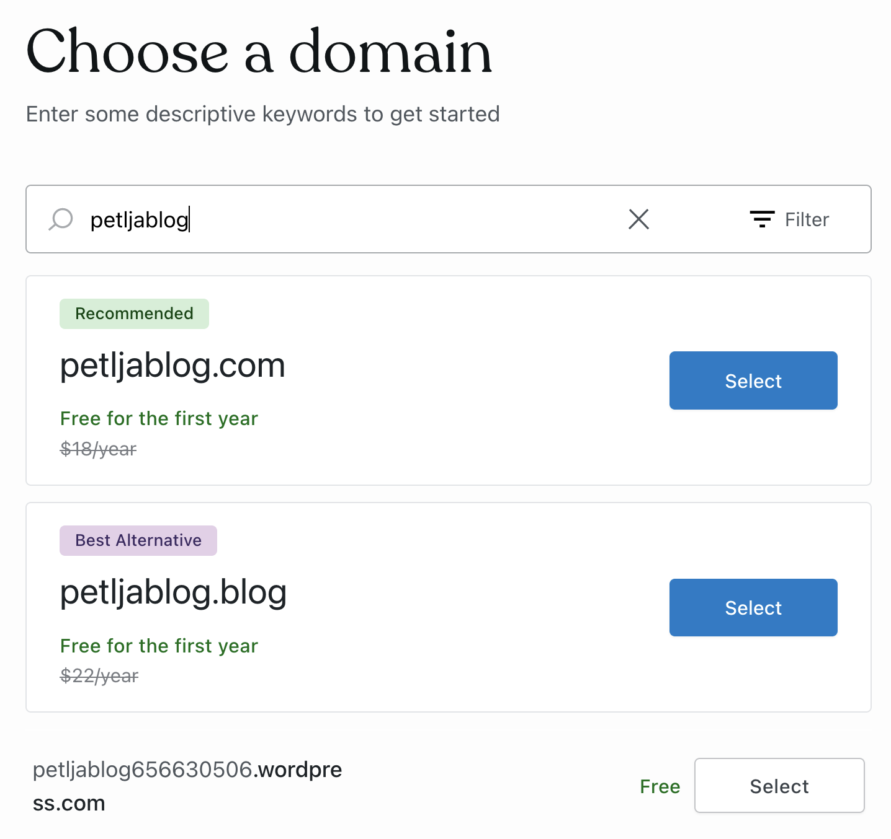
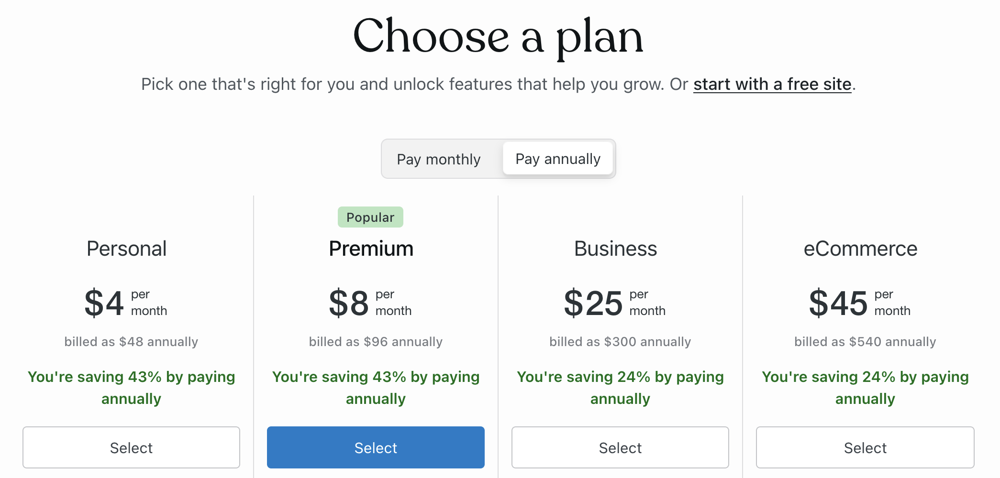
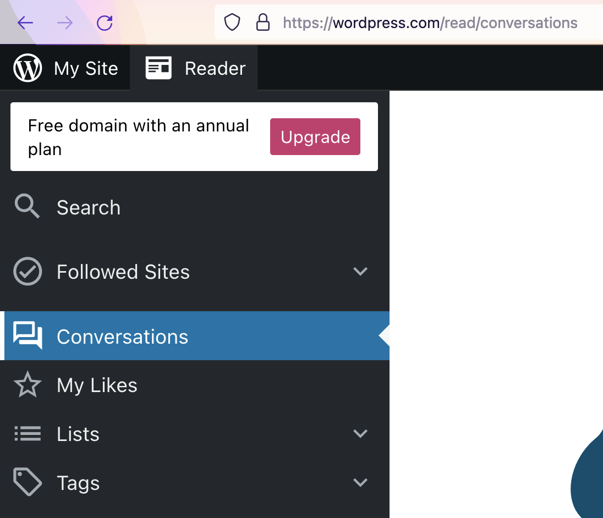
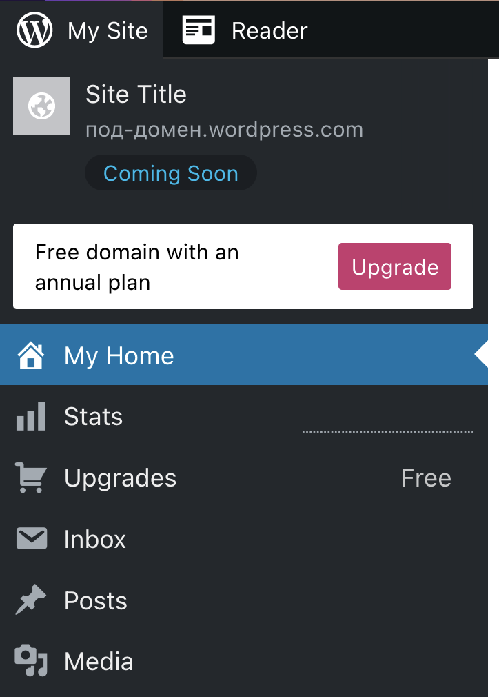
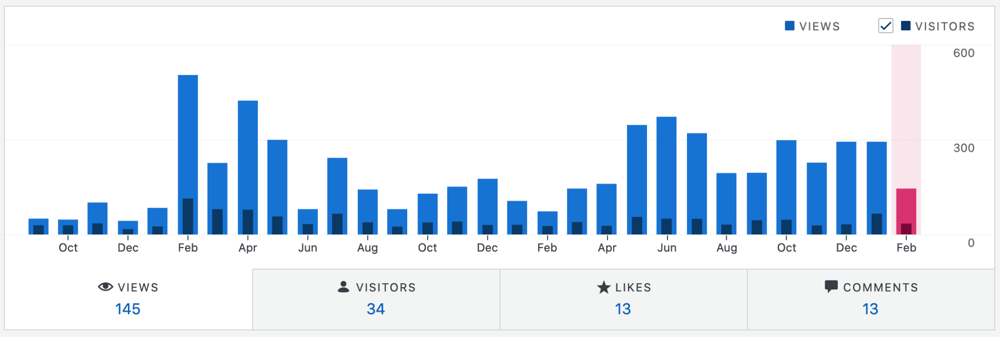
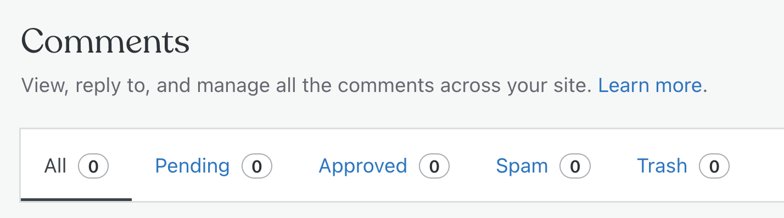

Основне компоненте система WordPress
====================================

Креирањем корисничког налога на веб-сајту `WordPress.com <https://wordpress.com>`_ се пролази кроз неколико корака.

Први корак је одабир домена веб-стране. *WordPress.com* даје могућност куповине домена, али је за наше потребе довољна опција бирања бесплатног под-домена. Добићете опцију за одабир под-домена у формату ``https://<под-домен>.wordpress.com``.

Следећи корак је одабир пакета услуга. За потребе овог курса, довољно је искористити опцију бесплатног веб-сајта (*start with a free site*).

Следећи кораци су везани за садржај који планирате на вашем сајту. Добијате кораке у којима можете да одаберете којој категорији припада ваш веб-сајт, који ће бити наслов веб-сајта и да одаберете почетни образац (тему) вашег веб-сајта. У горњем десном углу се налази дугме за прескакање (*Skip for now*) ових корака јер нису обавезни.

Након регистрације и логовања на веб-сајт `WordPress.com <https://wordpress.com>`_ могу се користити две основне услуге: *Reader* и *My Site*.

Услуга *Reader*
---------------

Услуга названа *Reader* (читалац) је нека врста часописа који корисник може да прилагоди својим интересовањима. Основна могућност која се нуди је избор сајтова које корисник жели да прати, тако да се објаве са тих сајтова појављују у часопису корисника. Ту су и уобичајене пратеће могућности, као што је лајковање и коментарисање објава. Могуће је водити и пратити разговоре о објавама, а корисник има и преглед разговора који га интересују. Поред тога, корисник може једноставно да креира своје кратке објаве, које ће видети други корисници.

Услуга *My Site*
----------------

Услуга названа *My Site* или *My Sites* (мој сајт, или моји сајтови, зависно од броја направљених сајтова) даје могућност кориснику да управља блоговима и веб-сајтовима. Како је тема овог курса креирање веб-сајтова, ставкама менија *My Site* ћемо се позабавити детаљније.

Ставке у менију *My Site* нас воде ка различитим секцијама, повезаним са развијањем сајта.

~~~~

**Секција Stats** омогућава праћење бројних статистичких података који се односе на веб-сајт.

Преко ставке *Traffic* помоћног менија корисник може да прати број прегледа (*views*) и број посетилаца (*visitors*), било по данима, недељама, месецима или годинама. Посебно су издвојене статистике за последњи дан, а може се пратити колико посетилаца долази из које земље, број кликова приликом посета и разни други подаци.

Кликом на ставку *Insights* (увиди) помоћног менија, корисник може да види колико је био активан у појединим периодима - у врло прегледном графичком приказу поједини дани у календару су осенчени различитим нијансама према броју објава (постова).

Присутни су и разни други подаци, као што је статистика последње објаве (број прегледа, лајкова и коментара), статистика пратилаца (колико их је дошло преко сајта *WordPress.com*, е-поште, друштвених мрежа), најпопуларнији дан и сат (којим даном је било највише посета, у којем сату има највише посета) и слично.

~~~~

**Секција Upgrades** нуди пакете услуга које корисник може да одабере. Поред бесплатног плана који нуди најскромније могућности, корисник може у оквиру различитих пакета да добије разне повољности као што су:

- подршка уживо,
- сопствени домен,
- више меморије за складиштење садржаја сајта,
- додатне теме за уређивање изгледа сајта,
- уклањање огласа компаније *WordPress.com* и слично.

~~~~

**Секција Inbox** је доступна на плаћеним пакетима и приказује долазну пошту на домену на ком се налази *WordPress* сајт.

~~~~

**Секцијe Posts, Media и Pages** дају преглед садржаја додатих на сајт (странице, објаве, мултимедијални садржаји - слике, видео), а нуде и могућност додавања нових садржаја. Ове секцију ћемо ускоро описати детаљније.

~~~~

**Секција Comments** даје увид у коментаре на веб-сајту.

Секција *Comments* садржи подсекције:

- *Pending* која приказује коментаре који још нису одобрени од стране руководиоца веб-сајта и самим тим нису приказани јавно,
- *Approved* која приказује коментаре који су објављени јавно,
- *Spam* која приказује коментаре које је *WordPress* детектовао као злоупотребу (више о `Спаму <https://sr.wikipedia.org/sr-ec/%D0%A1%D0%BF%D0%B0%D0%BC>`_ на Википедији) и
- *Trash* која приказује обрисане коментаре.

~~~~

**Секција Jetpack** (млазни ранац) омогућава детаљан преглед историје промена начињених на сајту. За плаћене планове може се пратити дужа историја, а промене се могу филтрирати како би се лакше пронашла тражена.

Поред тога, у оквиру плаћеног плана могуће је памћење појединих стања (*backup*), што је корисно у ситуацији када нисмо задовољни последњим променама сајта и желимо да се вратимо на неко од претходних стања.

~~~~

**Секција Appearance** има подсекције **Customize** и **Themes**.

Избором опције **Customize** прелази се у посебан модул (*customizer*, прилагођавач), у коме се могу подешавати изглед и фукционалност сајта. Из овог модула се могу мењати елементи страна, укључујући и наслов, позадинску слику и меније.

Избором опције **Themes** отвара се галерија понуђених тема, које дефинишу изглед и начин приказивања веб-страница, односно дају страницама визуелни иднтитет. Темом се најчешће задаје комбинација боја које се користе на сајту, фонтови, распоред елемената и слично. Тема сајта се може једноставно променити у било ком тренутку тако што се тема одебере кликом, и избор потврди притиском на дугме *Activate this design*.

~~~~

**Секција Plugins** нуди разне алате у виду прикључака за *WordPress*, помоћу којих се сајту корисника може лако додавати одређена специфична функционалност (у зависности од изабраног прикључка). Тако је на пример, могуће инсталирати прикључак који оптимизује сајт за боље рангирање од стране претраживача (*search engine optimization*, скраћено *SEO*), прикључак који омогућава посетиоцима сајта да направе своје профиле на сајту и постану регистровани посетиоци, прикључак за комуникацију са аутором сајта (додавањем одгвоарајућег интерфејса на некој од страница сајта), прикључак за аутоматско прављење резервних копија веб-сајта, као и прикључци за многе друге намене. Прикључке није могуће користити у оквиру бесплатног плана.

~~~~

**Секција Tools** даје могућност увожења и извожења садржаја веб-сајта. Ове могућности могу да буду згодне у случају да преместимо веб-сајт на други веб сервер, ако желимо да увеземо садржај са локалног рачунара и слично.

~~~~

**Секција Settings** садржи разне могућности као што су мењање адресе креираног сајта, подешавање коментара и мултимедијалног садржаја.
