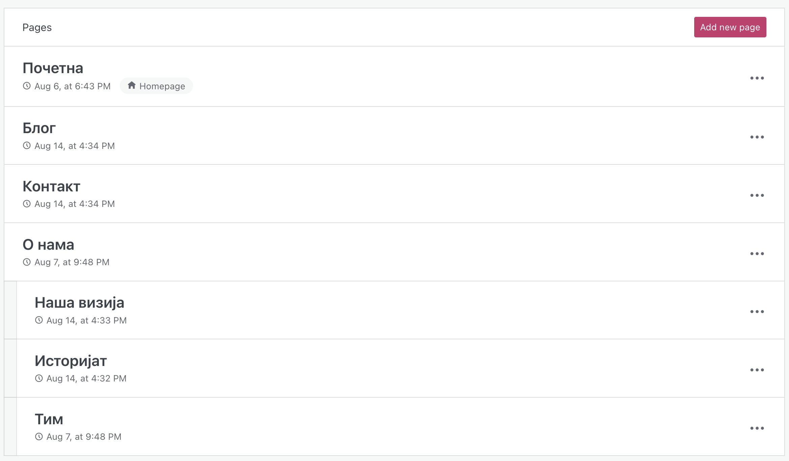
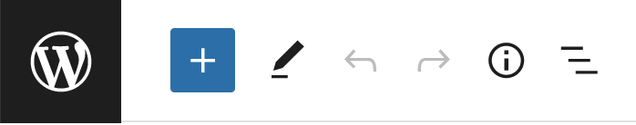

Креирање садржаја
=================

Креирање сајта подразумева пре свега смишљање његове структуре, а у оквиру тога креирање веб-страна од којих се сајт састоји. Број страна не мора да буде велики, често је то свега 3-4 стране. Типично, сајт садржи почетну страницу (*home page*), на којој се налази наслов сајта, појашњење о намени сајта, везе ка осталим страницама, а могу се наћи и други садржаји. Свака од осталих страна обично садржи везу ка почетној страници (или ка свим осталим странама), као и одређени специфичан садржај. На пример, уобичајена је страница на којој се власник сајта представља (*О мени* или *О нама*), једна или више страница са главним садржајем сајта, страница за контактирање власника сајта итд.

Блог, скраћено од "веб лог", је веб-страница (или група страница) која служи као нека врста јавно доступног журнала (дневника) аутора блога. Блог се састоји од хронолошки сортираних објава тј. постова (енгл. *post*), обично се ажурира једном у неколико дана (нема чврстог правила) и омогућава аутору да изнесе своја размишљања на одређене теме, реакције на догађаје и слично. На веб-сајтовима направљеним у систему *WordPress* једна (или више) страна може да буде организована као блог. Када се у систему *WordPress* креира нови сајт, иницијални изглед сајта садржи блог страницу.

Описан веб-сајт би имао следећу структуру:

Креирање објава на блогу
------------------------

Најједноставнији начин да се направи нова објава на блогу је да се у менију |btn_my_site| изабере опција *Posts → Add new*. Тиме се прелази у едитор у коме се може унети садржај објаве.

Едитор има могућност основног форматирања текста тако да се садржај приказује слично као у текст процесорима, то јест онако како ће бити приказан и у оквиру веб-стране (визуелно уређивање, или *WYSIWYG* - *What you see is what you get*).

Алтернативно, кликом на симбол ``⋮`` може се одабрати и директно уношење *HTML* кôда (опција *Code editor*), који садржи текст заједно са ознакама за форматирање.

Када довршимо објаву, објављујемо је кликом на дугме |btn_publish|. У зависности од подешавања опције *Always show pre-publish checks* ("увек преконтролиши пре објављивања"), може бити потребно да се и по други пут кликне на дугме *Publish*. Ако је опција *Always show pre-publish checks* укључена, пре другог клика на дугме *Publish* можемо да подесимо:

- коме ће објава бити видљива (нпр. само аутору, сарадницима, или свима),
- када ће бити објављена (време објављивања може да се одложи) и
- где желимо да поделимо објаву (нпр. налози на друштвеним мрежама који ће пренети вест о објави).

.. comment

    .. image:: ../../_images/wordpress/publish_option.png
       :align: center
       :width: 280

У случају да објаву изменимо (нпр. неком допуном или исправком), измењену објаву објављујемо кликом на дугме |btn_update|.

Дугме |btn_settings| (*settings*) нам омогућава да задамо особине објаве у целини или неког њеног блока.

Подешавања објаве
'''''''''''''''''

Објави можемо и накнадно да променимо видљивост (коме је објава видљива), да је фиксирамо на врху листе наших објава (*stick* -  прикачи), да је сврстамо у одређене категорије, или да јој доделимо етикете (*tags*).

.. figure:: ../../_images/wordpress/publish_settings.png
    :align: center
    :width: 300
    :class: screenshot-shadow

~~~~

Категорије су распоређене хијерархијски: свака категорија може да има подкатегорије. Помоћу категорија објаве разврставамо у групе и подгрупе. Етикете су кључне речи специфичне за поједине објаве. И категорије и етикете су врло корисне приликом претраге.

.. figure:: ../../_images/wordpress/publish_settings_categories.png
    :align: center
    :width: 300
    :class: screenshot-shadow

~~~~

У секцији *Featured Image* (истакнута слика) можемо да задамо слику, која ће се појавити заједно са скраћеним приказом (сажетком) објаве у листи објава.

~~~~

У секцији *Excerpt* (извод, сажетак) задајемо текст, који ће се појавити испод наслова објаве у листи објава. Уколико не задамо овај текст, *WordPress* ће аутоматски направити сажетак, најчешће тако што као сажетак искористи почетак објаве (првих 55 речи).

.. figure:: ../../_images/wordpress/publish_settings_excerpt.png
    :align: center
    :width: 300
    :class: screenshot-shadow

~~~~

У секцији *Discussion* задајемо да ли дозвољавамо коментаре на нашу објаву (*Allow comments*), као и да ли желимо да будемо обавештени ако неко референцира на нашу објаву (*Allow pingbacks & trackbacks*).

~~~~

*WordPress* аутоматски памти све објаве на којима сте радили, па и оне које сте обрисали или нисте довршили. Када прекинете рад на некој објави, не морате да предузимате никакве посебне акције ради чувања објаве у тренутном стању. По повратку у *WordPress*, кликните на *Posts → All Posts* у менију |btn_my_site| да се вратите на ваше објаве. Ако имате више објава, врх стране треба да изгледа слично овоме:

Ваше недовршене објаве ћете видети ако кликнете на дугме *Drafts*, а обрисане ако кликнете на *Trashed*. На дугме *Scheduled* добијате објаве чије објављивање је заказано за неко време у будућности. У ситуацији на слици видимо да постоји 3 објављених и једна недовршена објава.

Додавање мултимедијалних садржаја
'''''''''''''''''''''''''''''''''

Слике, аудио, видео, *pdf* документи и слични садржаји које желимо да стављамо у наше објаве (и на друге веб-стране) прво треба унети у медијску библиотеку (*Media Library*). Сваки од ових мултимедијалних садржаја се налази у неком фајлу. Фајлове додајемо у медијску библиотеку избором опције *Media* у менију |btn_my_site|, а затим кликом на |add_new_media|. Фајл можемо да додамо са рачунара за којим смо, или са задате локације на интернету.

Када се вратимо у објаву (опција *Posts → All Posts*, а затим избор неке од претходних или нове објаве), кликом на плус у сликовном менију можемо да убацимо у објаву садржај који смо раније додали у медијску библиотеку.

Након клика на плус, у листи понуђених типова блокова који се могу додати, треба (у групи *MEDIA*) пронаћи тип који одговара нашем садржају. На пример, ако хоћемо да додамо слику, изабраћемо тип *Image*. Следећи корак је да у дијалогу попут приказаног на следећој слици изаберемо одакле желимо да поставимо слику. У нашем случају, кликнућемо на *Select Image*, а затим *Media Library*, након чега изаберемо слику из медијске библиотеке.

Место и начин приказивања слике можемо да подешавамо помоћу оваквог сликовног менија:

.. figure:: ../../_images/wordpress/media_in_post3.png
    :align: center
    :width: 360
    :class: screenshot-shadow

Сликовни мени нам даје опције да:

- подесимо да се слика приказује у оквиру галерије или као слајд-шоу и слично,
- померимо слику навише или наниже,
- поравнање слике у односу на леву и десну маргину,
- подесимо слику да буде веза (линк) ка другој страни,
- изменимо величину или додамо неки текст и слично.

Мултимедијални садржај се неће појавити у сажетку објаве у листи објава, него тек када отворимо објаву и погледамо њен комплетан садржај. Слика се може појавити у сажетку само ако је задата у подешавањима као истакнута слика (*Settings → Featured Image*) као што је раније објашњено.

Додавање и брисање веб-страна
-----------------------------

Када почнемо да правимо Сајт у систему *WordPress*, као иницијално стање добијамо неке стране већ направљене (на пример, почетна страна, блог, страна о нама и страна за контакт). Уколико нам овај избор страна не одговара, можемо да обришемо неке од затечених страна, или да додамо нове. Такве промене радимо у секцији *Pages* у менију |btn_my_site|.

Постојећу страницу можемо да обришемо кликом на њу, а затим кликом на дугме |btn_settings| (*settings*) и на дугме |btn_move_to_trash|.

Нову страницу додајемо кликом на дугме |btn_add_new_page|. Први корак приликом прављења нове стране је дефинисање распореда њених елемената (*layout*). *WordPress* ће нам понудити неке готове распореде од којих можемо да изаберемо један по жељи, а можемо и да почнемо од празног распореда и да га сами дефинишемо елемент по елемент. Овај корак не можемо да обавимо касније, јер садржај стране зависи од распореда елемената. Уколико накнадно покушамо да изменимо распоред, то би уништило садржај који је у међувремену унет.

Даље попуњавање странице текстом, сликама и другим садржајем је веома слично креирању објава. Користимо исти едитор са могућностима визуелног приказа основног форматирања или уношења *HTML* кôда.

Кликом на дугме |btn_settings| приступамо подешавањима која су већином иста као код објава осим што, немају опцију да буду фиксиране на листи објава (опција *Stick to the top of the blog*) и немају категорије и етикете (тагове). Имају додатну секцију *Page attributes*.

~~~~

У секцији *Page Attributes* је за текућу страну могуће задати родитељску страну. Попуњавањем овог поља за све стране се формира хијерархија страна, која може да нам помогне да боље организујемо сајт. Једна страна може истовремено да буде родитељ неке групе страна и дете неке стране вишег нивоа у хијерархији.

Хијерархија страна се директно одражава на адресе тих страна, тако што се адреса стране у ствари добија дописивањем наставка те стране на адресу родитељске стране. На пример, ако за страницу *Наша визија* чији је наставак за адресирање *nasa-vizija* задамо да јој је родитељска страна *О нама*, чија је адреса *https://adresa_sajta.wordpress.com/o-nama*, онда је адреса стране са биографијом *https://adresa_sajta.wordpress.com/o-nama/nasa-vizija*. Стране којима се зада да немају родитељску страну (што је подразумевана поставка) су стране највишег нивоа и њихова адреса се и даље добија дописивањем наставка директно на адресу сајта.

Менији
''''''

Свака објављена страница сајта је увек доступна преко своје *URL* адресе. Међутим, посетиоци сајта обично не знају адресе појединачних страница. Директно уношење адресе сваке странице у прегледач није нарочито удобан начин да се страница посети. Менији се користе да би структура сајта била јаснија посетиоцима и сам сајт лакши за прегледање. Мени омогућава да се са једне странице пређе на другу једноставним кликом.

Свака тема садржи један или више менија који могу да буду приказани на различите начине и на различитим местима на страни. Уобичајено је да постоји један главни мени који се приказује у заглављу сваке стране и преко којег се може посетити свака страна сајта. Главни мени се може поставити и у бочну или навигациону траку, мада је то ређи случај.

Поред главног менија, сајту могу да се додају разни споредни менији, који могу, а не морају, да се појављују на свакој страници сајта.

~~~~

До секције за управљање менијима долазимо избором *Appearance → Customize → Menus* у менију |btn_my_site|. Овде је могуће додати меније и преименовати или обрисати постојећи. Одабиром менија који желимо да уређујемо појављују се његове ставке (ако их има).

Одабир ставке менија даје могућност преименовања или брисања. Редослед ставки се може променити превлачењем постојећих ставки горе или доле.

Ставке менија могу да буду организоване и у више нивоа, то јест да формирају хијерархију. Хијерархија ставки у менију се уређује назависно од хијерархије родитељских страна.  тавке у менију се и хијерархијски могу једноставно уређивати мишем тако што ставку повучемо лево или десно, чиме јој мењамо ниво у хијерархији. Кликом на опцију *Reorder*, на ставкама добијамо и дугмад (стрелице) за померање тих ставки.

|

Ставке менија се додају кликом на дугме *Add Items*. Нова ставка најчешће води ка некој од страница сајта, али то није једина могућност (зато се хијерархије менија и страна и уређују независно). Ставке менија могу, на пример, да воде ка појединим објавама, ка листи објава из одређене категорије, или ка странама других сајтова (између осталог, могуће је направити и ставке које не воде никуда него само садрже друге ставке нижег хијерархијског нивоа). Због тога се после клика на дугме *Add Items* појављује подмени у коме прво треба изабрати каква ставка се додаје менију (за везе ка страницама нашег сајта треба изабрати *pages* итд.).

У секцији *Menu Locations* могуће је задати у којој области (или областима) странице сајта ће се мени приказивати.

У секцији *Menu Оptions* можемо да подесимо да се свака будућа страна која нема родитељску страну аутоматски дода на крај овог менија. Препорука је да се ова опција ипак не укључује, јер се при мање спретној употреби у менију могу појавити странице које нисмо намеравали да додамо.

.. figure:: ../../_images/wordpress/menu_options.png
    :align: center
    :width: 300
    :class: screenshot-shadow
