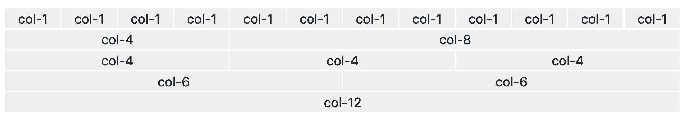
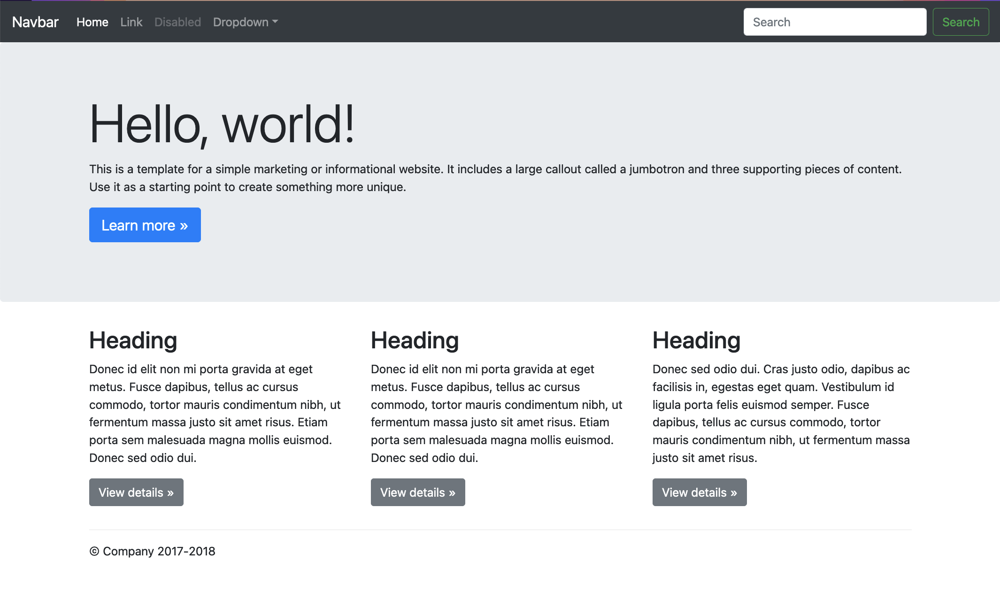
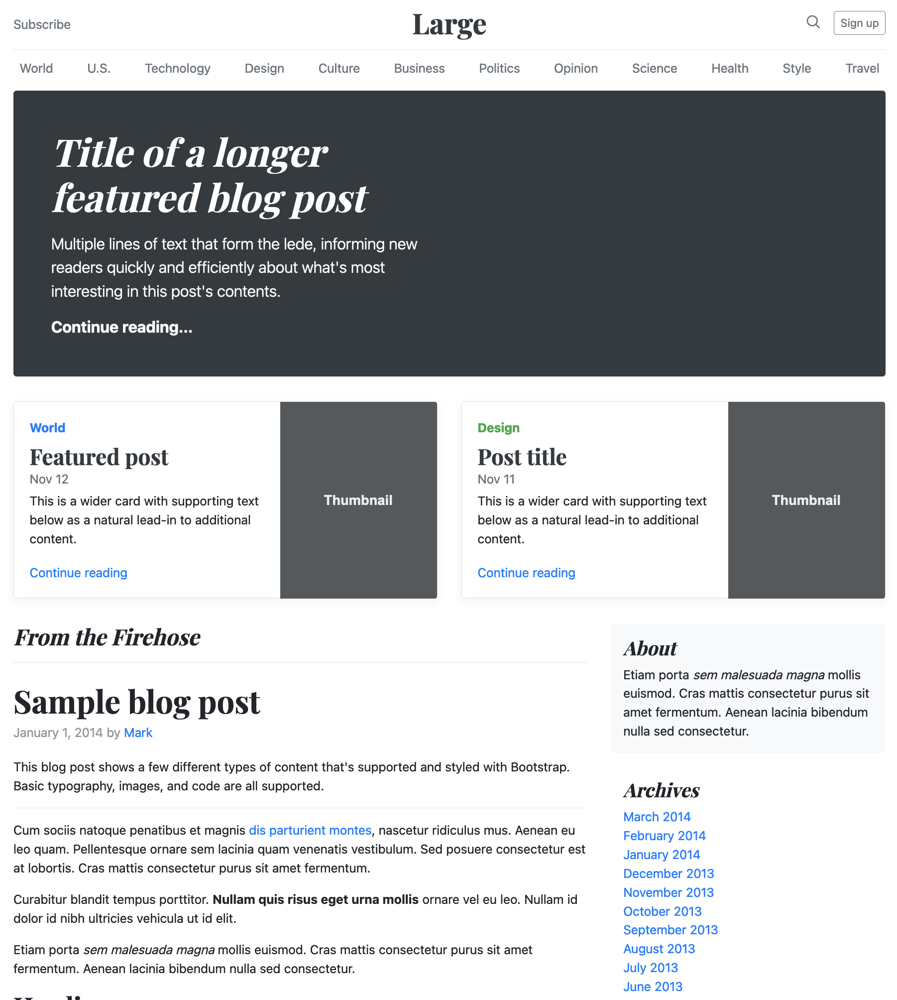

*Bootstrap* и распоређивање елемената
=====================================

*Bootstrap* за распоређивање елемената користи систем мреже (engl. *grid system*).

Хијерархија елемената у оваквом систему захтева да имамо контејнер елемент, у њему елементе који представљају редове, и у сваком реду елементе колона.

*Bootstrap* може да распореди елементе по контејнерима, који заузимају најмање дванаестину ширине стране (*col-1*) а највише целу ширину (*col-12*):

    
Контејнери ``col-1`` су најужи и може се ставити 12 блокова ове ширине у један ред. Блокови различитих ширина се могу комбиновати у једном реду (на пример ``col-4`` и ``col-8`` у трећем реду), под условом да не пређу укупну ширину 12.

.. petlja-editor:: bootstrap_grid_demo

    style.css
    .container-fluid {
        padding: 20px;
    }
    .col-1, .col-4, .col-6, .col-8, .col-12 {
        background-color: #efefef;
        text-align: center;
        border: 1px solid white;
    }
    ~~~
    index.html
    <!doctype html>
    <html>
    <head>
        <title>Bootstrap</title>
        <link href="https://cdn.jsdelivr.net/npm/bootstrap@5.2.0/dist/css/bootstrap.min.css" rel="stylesheet" crossorigin="anonymous">
        <link rel="stylesheet" href="style.css"/>
    </head>
    <body>
        

            

                
col-1

                
col-1

                
col-1

                
col-1

                
col-1

                
col-1

                
col-1

                
col-1

                
col-1

                
col-1

                
col-1

                
col-1

            

            

                
col-4

                
col-8

            

            

                
col-4

                
col-4

                
col-4

            

            

                
col-6

                
col-6

            

            

                
col-12

            

        

    </body>
    </html>

У следећем примеру је приказан кôд реда који у себи има 3 ``
`` блока исте ширине:

.. petlja-editor:: bootstrap_grid_1

    style.css
    .crvena {
        background-color: red;
    }
    .plava {
        background-color: blue;
        color: white;
    }
    .zelena {
        background-color: green;
    }
    ~~~
    index.html
    <!doctype html>
    <html>
    <head>
        <title>Bootstrap</title>
        <link href="https://cdn.jsdelivr.net/npm/bootstrap@5.2.0/dist/css/bootstrap.min.css" rel="stylesheet" crossorigin="anonymous">
        <link rel="stylesheet" href="style.css"/>
    </head>
    <body>
        

            

                

                    Ред 1 Колона 1
                

                

                    Ред 1 Колона 2
                

                

                    Ред 1 Колона 3
                

            

        

    </body>
    </html>

У овом примеру, ``
`` блокови ће заузети по трећину ширине стране (као ``col-4`` са горње слике), пошто ширине нису експлицитно наведене у *CSS* класама.

.. questionnote::

    **Вежба**

    Измените претходни пример тако да колоне буду распоређене:

    - прва колона ширине 2 блока,
    - друга колона ширине 6 блокова,
    - трећа колона ширине 4 блока.

    Након тога, пробајте да другој колони додате ширину 7 блокова. Тада збир прелази 12 (2 + 7 + 4 = 13). Који је резултат?

*Bootstrap* има и посебне класе са префиксима ``col-sm-``, ``col-lg-`` и слично. Више информација о овим класама се може наћи на сајту `Bootstrap <https://getbootstrap.com/docs/5.2/layout/grid/#responsive-classes/>`_.

Распоред – Пример 1
-------------------

Потребно је направити *Bootstrap* распоред за следећи дизајн  (занемарићемо садржај):

Елемент ``div`` са класом ``hello-world`` заузима целу ширину и има позадинску боју, као на слици. Користећи класу ``.container-sm`` постижемо да се ширина садржаја ограничи и садржај центрира.

.. petlja-editor:: bootstrap_grid_2

    style.css
    .row {
        border: 1px dashed #ccc;
    }

    .col, .col-4, .col-6, .col-8 {
        border: 1px dotted red;
    }

    .hello-world {
        background-color: skyblue;
    }
    ~~~
    index.html
    <!doctype html>
    <html>
    <head>
        <title>Bootstrap</title>
        <link href="https://cdn.jsdelivr.net/npm/bootstrap@5.2.0/dist/css/bootstrap.min.css" rel="stylesheet" crossorigin="anonymous">
        <link rel="stylesheet" href="style.css"/>
    </head>
    <body>
        

            
Navbar…

        

        

            

                

                    

                        <h1>Hello World</h1>
                        
...

                    

                

            

        

        

            <!-- Ред са 3 колоне -->
            

                

                    <h2>Heading</h2>
                    
...

                

                

                    <h2>Heading</h2>
                    
...

                

                

                    <h2>Heading</h2>
                    
...

                

            

            

                
&copy; Company 2017

            

        

    </body>
    </html>

Распоред – Пример 2
-------------------

Потребно је направити распоред ``
`` блокова који одговара следећој страни (занемарићемо садржај):

    
Прва три реда (лого, навигација и велики наслов) заузимају пуну ширину стране и зато имају по један ``
`` у реду.

Потом следи ред са две колоне једнаких ширина које садрже два главна чланка. За две колоне једнаких ширине користимо ``col-6`` да би добили збир од 12 колона.

На крају се налази ред у коме је лева колона (чланак) два пута шира од десне (секција *About*). Одговарајуће колоне би биле ``col-8`` и ``col-4``.

*Bootstrap* распоред који одговара овој страни је:

.. petlja-editor:: bootstrap_grid_3

    style.css
    .row {
        border: 1px dashed #ccc;
    }

    .col, .col-4, .col-6, .col-8 {
        border: 1px dotted red;
    }
    ~~~
    index.html
    <!doctype html>
    <html>
    <head>
        <title>Bootstrap</title>
        <link href="https://cdn.jsdelivr.net/npm/bootstrap@5.2.0/dist/css/bootstrap.min.css" rel="stylesheet" crossorigin="anonymous">
        <link rel="stylesheet" href="style.css"/>
    </head>
    <body>
        <!-- Лого -->
        

          

            <h1>Large</h1>
          

        

        <!-- Навигациона трака -->
        

          

            World | U.S. | Technology | ...
          

        

        <!-- Издвојен чланак -->
        

          

            <h1>
                Title of a longer 
                featured blog post
            </h1>
          

        

        <!-- Два издвојена чланка -->
        

          

            <h2>Featured post</h2>
            
...

          

          

            <h2>Post title</h2>
            
...

          

        

        

          <!-- Главни садржај стране -->
          

            <h1>Sample blog post</h1>
            
...

          

          <!-- Споредна секција -->
          

            <h2>About</h2>
            
...

          

        

    </body>
    </html>
